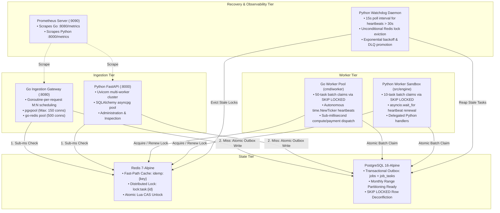
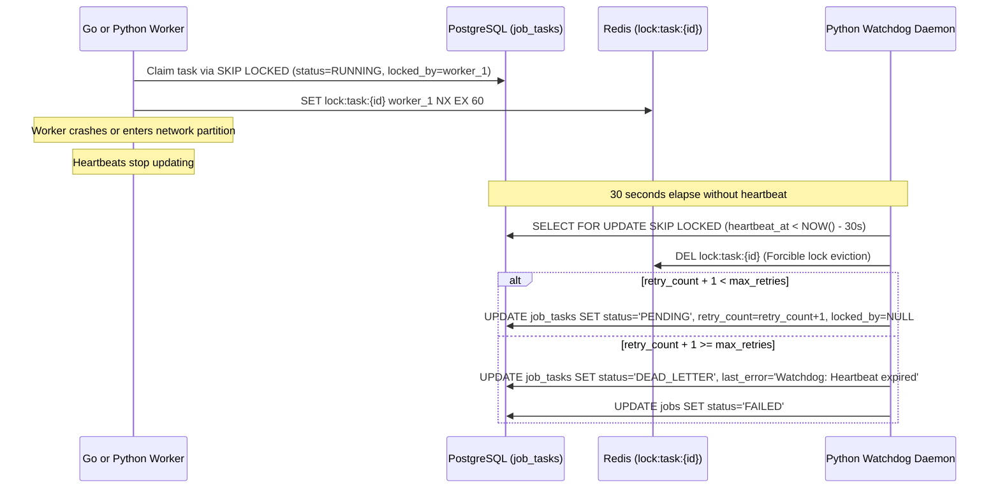

# Architecture — System Internals & Polyglot Technical Deep-Dive

This document details the internal mechanics, pipeline flow, database schema, concurrency controls, and failure recovery paths of the Distributed Transaction & Task Orchestration Engine.

All code symbols, table definitions, index names, configuration thresholds, and SQL statements match the production implementation across the Go acceleration gateway (`services/gateway/`) and Python engine (`src/`).

---

## Table of Contents

1. [High-Level Architectural Topology](#1-high-level-architectural-topology)
2. [Data Models, State Transitions & Storage Contracts](#2-data-models-state-transitions--storage-contracts)
3. [Go Ingestion Gateway Pipeline (`services/gateway/cmd/gateway`)](#3-go-ingestion-gateway-pipeline-servicesgatewaycmdgateway)
4. [Declarative Range Partitioning Architecture (20M+ Scale)](#4-declarative-range-partitioning-architecture-20m-scale)
5. [Polyglot Worker Pool & Concurrency Engine](#5-polyglot-worker-pool--concurrency-engine)
6. [Distributed Locking Implementation & Lua CAS Mechanics](#6-distributed-locking-implementation--lua-cas-mechanics)
7. [Cross-Runtime Watchdog Reaper & DLQ Promotion](#7-cross-runtime-watchdog-reaper--dlq-promotion)
8. [Connection Pooling & Resource Sizing Matrix](#8-connection-pooling--resource-sizing-matrix)

---

## 1. High-Level Architectural Topology

The engine utilizes a dual-plane hybrid architecture:



- **Ingestion Acceleration**: External clients route high-throughput write traffic directly to the Go Gateway (`:8080`), achieving **1,133+ req/s** sustained throughput with sub-second p95 latency under 500 concurrent virtual users.
- **Worker Draining**: The Go worker pool consumes tasks in 50-task batches, sustaining **560 tasks/s** drain rates across 2 workers with zero lock contention.
- **Compatibility & Recovery**: The Python FastAPI service (`:8000`) provides job introspection and management, while the autonomous Python Watchdog monitors worker health and orchestrates dead-letter queue routing.

---

## 2. Data Models, State Transitions & Storage Contracts

### 2.1 Job & Task State Machine

```
                      POST /v1/jobs
                           │
                           ▼
                        PENDING
                           │
             Worker claims via SKIP LOCKED
                           │
                           ▼
                        RUNNING ──────────────────────────────┐
                           │                                  │
                handler.execute() completes                   │ Watchdog: heartbeat
                           │                                  │ expired, retry < max
                           ▼                                  ▼
                       COMPLETED                           PENDING (retry++)
                                                              │
                                          retry_count + 1 >= max_retries
                                                              │
                                                              ▼
                                                         DEAD_LETTER
                                                     (job.status → FAILED)
```

The valid statuses are:
- `PENDING`: Task queued, eligible for worker claim.
- `RUNNING`: Task claimed by an active worker holding database and Redis lock leases.
- `COMPLETED`: Successfully executed by handler; terminal state.
- `FAILED`: Parent job rollup status when one or more child tasks are dead-lettered.
- `DEAD_LETTER`: Permanently failed task whose retries have exceeded `max_retries`.

### 2.2 Table Schema: `jobs`

Stores parent job records and serves as the deduplication anchor.

```sql
CREATE TABLE jobs (
    id               UUID PRIMARY KEY DEFAULT gen_random_uuid(),
    idempotency_key  VARCHAR(128) UNIQUE NOT NULL,
    job_type         VARCHAR(64) NOT NULL,
    status           VARCHAR(32) NOT NULL DEFAULT 'PENDING',
    created_at       TIMESTAMPTZ NOT NULL DEFAULT now()
);

-- Operational Indexes:
CREATE INDEX ix_jobs_status_created_at ON jobs (status, created_at);
CREATE UNIQUE INDEX ix_jobs_idempotency_key ON jobs (idempotency_key);
```

### 2.3 Table Schema: `job_tasks`

Stores discrete execution units linked to parent jobs.

```sql
CREATE TABLE job_tasks (
    id            UUID PRIMARY KEY DEFAULT gen_random_uuid(),
    job_id        UUID NOT NULL REFERENCES jobs(id) ON DELETE CASCADE,
    handler_name  VARCHAR(64) NOT NULL,
    status        VARCHAR(32) NOT NULL DEFAULT 'PENDING',
    payload       JSONB NOT NULL DEFAULT '{}',
    retry_count   INTEGER NOT NULL DEFAULT 0,
    max_retries   INTEGER NOT NULL DEFAULT 3,
    locked_by     VARCHAR(64),
    heartbeat_at  TIMESTAMPTZ,
    last_error    TEXT,
    created_at    TIMESTAMPTZ NOT NULL DEFAULT now(),
    updated_at    TIMESTAMPTZ NOT NULL DEFAULT now()
);

-- Operational Indexes:
CREATE INDEX ix_job_tasks_status_created_at ON job_tasks (status, created_at);
CREATE INDEX ix_job_tasks_job_id ON job_tasks (job_id);

-- Hot-Path Partial Indexes:
CREATE INDEX ix_job_tasks_pending_running 
    ON job_tasks (status, created_at) 
    WHERE status IN ('PENDING', 'RUNNING');

CREATE INDEX ix_job_tasks_heartbeat_at 
    ON job_tasks (heartbeat_at) 
    WHERE heartbeat_at IS NOT NULL;
```

**Partial Index Efficiency**:
The partial index `ix_job_tasks_pending_running` only tracks active tasks (`PENDING` or `RUNNING`). In production environments where 99%+ of historical tasks are `COMPLETED`, this index stays extremely compact (a few megabytes for millions of historical rows) and fits entirely inside PostgreSQL's `shared_buffers`.

---

## 3. Go Ingestion Gateway Pipeline (`services/gateway/cmd/gateway`)

The Go Ingestion Gateway is designed to maximize raw network throughput and minimize allocation overhead by bypassing ORM hydration and the Python GIL.

### 3.1 Concurrency Model & Connection Pooling

- **Goroutine-per-Request**: The Go HTTP server spawns an independent, lightweight goroutine (consuming ~2 KB of stack) for every inbound connection.
- **PostgreSQL Connection Pool (`pgxpool/v5`)**:
  ```go
  cfg.MaxConns = 150
  cfg.MinConns = 25
  cfg.MaxConnLifetime = 30 * time.Minute
  cfg.MaxConnIdleTime = 5 * time.Minute
  cfg.HealthCheckPeriod = 60 * time.Second
  ```
  - `MaxConns: 150`: Caps gateway connections to allow multiple gateway replicas to share PostgreSQL's `max_connections = 500`.
  - `MinConns: 25`: Maintains pre-warmed database connections, eliminating TCP handshake and TLS/auth latency on burst arrivals.
  - Raw binary protocol execution with `pgx/v5` avoids text-protocol encoding overhead.
- **Redis Connection Multiplexing (`go-redis/v9`)**:
  ```go
  rdb := redis.NewClient(&redis.Options{
      Addr:         addr,
      PoolSize:     500,
      MinIdleConns: 25,
      DialTimeout:  2 * time.Second,
      ReadTimeout:  1 * time.Second,
      WriteTimeout: 1 * time.Second,
  })
  ```

### 3.2 Ingestion Step-by-Step Pipeline

```
Inbound HTTP Request: POST /v1/jobs
  │
  ├── 1. Header Validation: Idempotency-Key present?
  │      No ──► Return 400 Bad Request (Zero DB/Redis allocation)
  │
  ├── 2. Fast-Path Redis Check: GET idemp:{key}
  │      HIT ──► Return 202 Accepted {"job_id": "...", "status": "...", "cached": true} (<1ms)
  │
  └── 3. Fast-Path MISS: Begin PostgreSQL Outbox Transaction (ReadCommitted)
         │
         ├── INSERT INTO jobs (idempotency_key, job_type) 
         │   VALUES (...) 
         │   ON CONFLICT (idempotency_key) DO NOTHING 
         │   RETURNING id, status
         │
         ├── Row Returned (New Job):
         │   ├── INSERT INTO job_tasks (job_id, handler_name, payload) VALUES (...)
         │   └── Commit Transaction
         │
         ├── Zero Rows Returned (Conflict Window Race):
         │   ├── Rollback Outbox Transaction
         │   └── SELECT id, status FROM jobs WHERE idempotency_key = $1
         │
         ├── 4. Backfill Redis Fast-Path:
         │      SET idemp:{key} <json> EX 86400 (24h TTL)
         │
         └── 5. Return HTTP 202 Accepted {"job_id": "...", "status": "...", "cached": false}
```

---

## 4. Declarative Range Partitioning Architecture (20M+ Scale)

At an enterprise scale of 20,000,000+ lifetime tasks, single-table B-Tree indexes exceed available RAM, leading to disk paging and degraded `SKIP LOCKED` query times. The engine incorporates a monthly range partitioning architecture ready for zero-downtime cutover.

### 4.1 Schema Partitioning Strategy

Defined in [`docs/migrations/001_partition_job_tasks.sql`](migrations/001_partition_job_tasks.sql):

```sql
CREATE TABLE job_tasks (
    id            UUID        NOT NULL,
    job_id        UUID        NOT NULL REFERENCES jobs(id) ON DELETE CASCADE,
    handler_name  VARCHAR(64) NOT NULL,
    status        TEXT        NOT NULL DEFAULT 'PENDING',
    payload       JSONB       NOT NULL DEFAULT '{}',
    retry_count   INTEGER     NOT NULL DEFAULT 0,
    max_retries   INTEGER     NOT NULL DEFAULT 3,
    locked_by     VARCHAR(64),
    heartbeat_at  TIMESTAMPTZ,
    last_error    TEXT,
    created_at    TIMESTAMPTZ NOT NULL DEFAULT now(),
    updated_at    TIMESTAMPTZ NOT NULL DEFAULT now(),
    PRIMARY KEY (id, created_at)
) PARTITION BY RANGE (created_at);
```

- **Partition Key**: `created_at`. Under PostgreSQL declarative partitioning, the partition key must be part of the primary key.
- **Partition Granularity**: Monthly ranges (`job_tasks_YYYY_MM`):
  ```sql
  CREATE TABLE job_tasks_2026_10 PARTITION OF job_tasks
      FOR VALUES FROM ('2026-10-01') TO ('2026-11-01');
  ```
- **Overflow Catch-All**:
  ```sql
  CREATE TABLE job_tasks_default PARTITION OF job_tasks DEFAULT;
  ```
  Guarantees that boundary edge cases never trigger transaction failures.

### 4.2 Query Pruning Mechanics

Because worker polling queries order by `created_at ASC` and filter on active statuses:
```sql
SELECT id, job_id, handler_name FROM job_tasks
WHERE status = 'PENDING'
ORDER BY created_at ASC
LIMIT 50
FOR UPDATE SKIP LOCKED;
```
PostgreSQL's query planner activates **Partition Pruning**, eliminating older historical partition tables from the query scan tree. Combined with partial index `ix_job_tasks_pending_running`, worker queries scan only active pages in the current month's partition.

---

## 5. Polyglot Worker Pool & Concurrency Engine

The worker plane operates on a polyglot cooperative model where both Go workers and Python workers process tasks from the shared PostgreSQL queue.

### 5.1 Go High-Performance Worker (`services/gateway/cmd/worker`)

The Go worker is optimized for high-volume, I/O-intensive task execution:

1. **Batch Claim Loop**:
   - Polls every 200 ms using `SELECT ... FOR UPDATE SKIP LOCKED` with a batch size of 50.
   - Atomically updates claimed tasks to `status = 'RUNNING'`, setting `locked_by = worker_id` and `heartbeat_at = NOW()` in a single transaction.
2. **Concurrency Limiter**:
   - Uses a channel semaphore (`sem := make(chan struct{}, 100)`) to restrict concurrent in-flight task execution to 100 simultaneous goroutines per worker instance.
3. **Non-Blocking Heartbeat Ticker**:
   - An independent goroutine runs `time.NewTicker(10 * time.Second)`.
   - On each tick, it updates `heartbeat_at = NOW()` in PostgreSQL and extends the Redis lock TTL via `client.RenewLock(ctx, taskIDStr)`.
   - Termination is signaled via `close(heartbeatDone)`, ensuring the ticker goroutine exits cleanly before lock release.
4. **Isolated Termination Context**:
   - When a task finishes or fails, status updates (`CompleteTask` or `FailTask`) execute under an independent `context.WithTimeout(context.Background(), 5*time.Second)`. This guarantees that in-flight tasks record their terminal state in PostgreSQL even if the parent application context receives a `SIGINT` or `SIGTERM`.

### 5.2 Python Worker Sandbox (`src/engine/worker.py`)

The Python worker provides compatibility for complex workflow logic and external library dependencies:
- Claims batches of 10 tasks via `SELECT ... FOR UPDATE SKIP LOCKED`.
- Processes tasks concurrently via `asyncio.gather`.
- Runs `_heartbeat_loop` alongside handler execution using `asyncio.wait_for(cancel_event.wait(), timeout=10.0)`.

---

## 6. Distributed Locking Implementation & Lua CAS Mechanics

To prevent split-brain execution during network delays or transient worker stalls, the engine implements distributed locks in Redis as a secondary mutual-exclusion barrier.

### 6.1 Lock Key Format & Lease Acquisition

```
Key: lock:task:{task_id}
Value: {worker_id}
TTL: 60 seconds
```

Acquisition uses an atomic `SET NX EX` command:
```go
ok, err := c.rdb.SetNX(ctx, "lock:task:"+taskID, workerID, 60*time.Second).Result()
```
If `ok == false`, another worker or watchdog holds an unexpired lease. The worker immediately abandons processing of that task.

### 6.2 Atomic Compare-and-Swap (CAS) Release via Lua

When a worker completes a task, it must release the lock **only if it still owns it**:

```lua
if redis.call("get", KEYS[1]) == ARGV[1] then
    return redis.call("del", KEYS[1])
else
    return 0
end
```

**Why CAS is Critical**:
1. Worker A claims Task 1 and acquires `lock:task:1` with owner `worker-A`.
2. Worker A experiences a 40-second network stall or garbage collection pause.
3. The 30-second Watchdog threshold expires. The Watchdog evicts the lock and resets Task 1 to `PENDING`.
4. Worker B claims Task 1 and acquires `lock:task:1` with owner `worker-B`.
5. Worker A resumes and completes Task 1.
6. **Without Lua CAS**: Worker A executes `DEL lock:task:1`, silently deleting Worker B's active lock and leaving Worker B unprotected.
7. **With Lua CAS**: Worker A passes `ARGV[1] = "worker-A"`. Redis detects `GET != ARGV[1]` and returns `0`. Worker B's lock remains safely held.

---

## 7. Cross-Runtime Watchdog Reaper & DLQ Promotion

The Python Watchdog daemon (`src/engine/watchdog.py`) is the autonomous safety net governing worker lifecycle and task recovery.



### 7.1 Stale Heartbeat Sweep

Every 15 seconds (`interval = 15`), the watchdog executes:

```sql
SELECT id, job_id, retry_count, max_retries
FROM job_tasks
WHERE status = 'RUNNING'
  AND (heartbeat_at < NOW() - INTERVAL '30 seconds' OR heartbeat_at IS NULL)
FOR UPDATE SKIP LOCKED;
```

`FOR UPDATE SKIP LOCKED` guarantees:
1. Multiple watchdog instances do not contend or double-process stale tasks.
2. The watchdog never blocks on a worker that is in the middle of committing an in-flight status update.

### 7.2 Forcible Lock Eviction & Dead-Letter Promotion

For every returned task:
1. **Redis Key Eviction**: Executes `DEL lock:task:{id}` unconditionally. By definition, any task with a heartbeat older than 30s is either dead or orphaned.
2. **Retry Tracking**:
   - If `retry_count + 1 < max_retries`: The task is reset to `PENDING` with an incremented `retry_count`, making it immediately visible to healthy workers in the next poll cycle.
   - If `retry_count + 1 >= max_retries`: The task is permanently transitioned to `DEAD_LETTER`, and the parent `jobs` record is updated to `FAILED`.

---

## 8. Connection Pooling & Resource Sizing Matrix

To prevent connection starvation under high concurrency, pool sizes are balanced across all components to ensure cumulative demand never exceeds backend engine limits:

| Service | Driver / Engine | Configuration Parameters | Maximum Conns |
|---|---|---|---|
| **Go Gateway** | `jackc/pgx/v5/pgxpool` | `MaxConns: 150`, `MinConns: 25` | 150 |
| **Go Worker Pool** | `jackc/pgx/v5/pgxpool` | `MaxConns: 50`, `MinConns: 10` | 50 |
| **Python FastAPI** | SQLAlchemy `asyncpg` | `pool_size: 25`, `max_overflow: 50` | 75 per worker (150 total) |
| **Python Worker Pool** | SQLAlchemy `asyncpg` | `pool_size: 20`, `max_overflow: 20` | 40 |
| **Python Watchdog** | SQLAlchemy `asyncpg` | `pool_size: 5`, `max_overflow: 5` | 10 |
| **PostgreSQL Backend** | PostgreSQL 16 | `max_connections = 500` | **Total Allocated: 400 / 500** |
| **Go Gateway Redis** | `go-redis/v9` | `PoolSize: 500`, `MinIdleConns: 25` | 500 |
| **Python Redis** | `redis-py` (asyncio) | `max_connections = 1000` | 1,000 |
| **Redis Server** | Redis 7-Alpine | `maxclients = 10000` | **Total Allocated: 1,500 / 10,000** |

This sizing architecture leaves 100 reserve database connections for administrative `psql` sessions, Prometheus scraping, pgbench audits, and database migrations.
